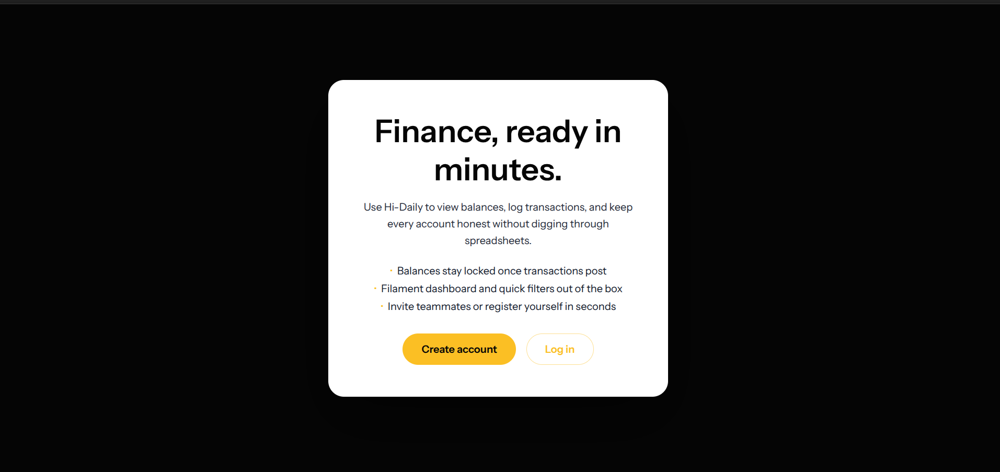
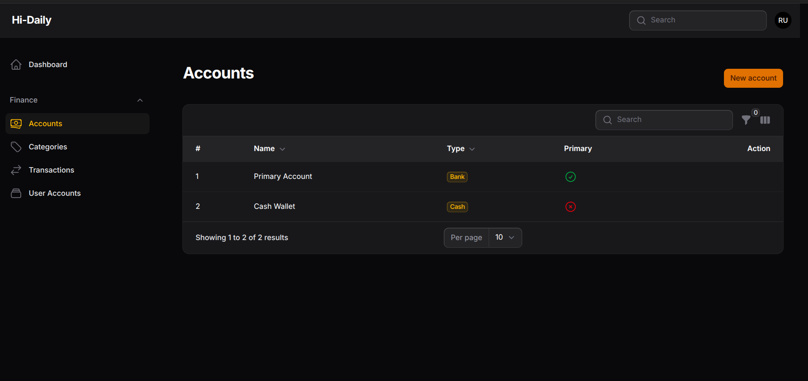

# Fillament Track

A Filament-powered finance tracker for managing accounts, categories, and transactions with rich tables, filters, and dashboards.

## Features

- Multi-account management with primary/secondary relationships.
- Categorized transactions with income, expense, and transfer support.
- Dynamic filters, default current-month view, and per-type badge styling.
- Admin-only management for users, accounts, and assignments.
- Dashboard summary cards plus (soon) visual reporting widgets.

## Requirements

- PHP 8.2+
- Composer 2+
- Node.js 18+ and npm (for Vite assets)
- MySQL or another database supported by Laravel
- Redis/queue worker (optional, only if you plan to process queued jobs)

## Installation

1. **Clone the repository**
	```bash
	git clone https://github.com/Devajayantha/fillament-track.git
	cd fillament-track
	```
2. **Environment variables**
	```bash
	cp .env.example .env
	```
	Update database/mail credentials and set `APP_URL` to match your domain.
3. **Install dependencies**
	```bash
	composer install
	npm install
	```
4. **Generate the application key**
	```bash
	php artisan key:generate
	```
5. **Run migrations and seed demo data**
	```bash
	php artisan migrate --seed
	```
6. **Build assets**
	```bash
	npm run build   # or npm run dev for local hot reload
	```
7. **Serve the application**
	```bash
	php artisan serve
	```

You should now be able to access the panel at `http://localhost:8000/dashboard`.

## Demo

- Live preview: [track.devajayantha.web.id](https://track.devajayantha.web.id)

| Role  | Email              | Password |
|-------|--------------------|----------|
| Admin | admin@example.com  | password |
| User  | user@example.com   | password |

> The seeded credentials above are safe to reset via `php artisan migrate:fresh --seed` during local development.

## Screenshots




## Contributing

We’re open to contributions! open an issue or pull request, describe the feature/bug, and we’ll sync up before merging.


### Contributors

- Devajayantha
- _Your name here_ ✨

## In Progress

- Add report chart on dashboard (tracking category/date filters).

## License

This project is released under the [MIT license](LICENSE).
